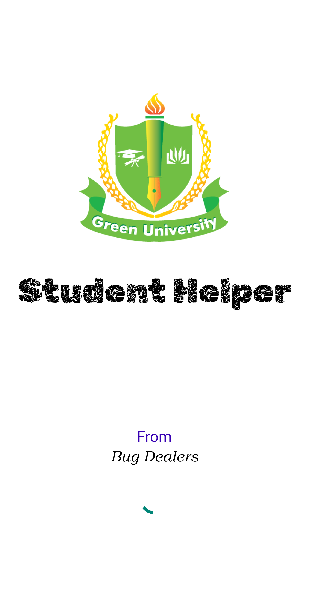
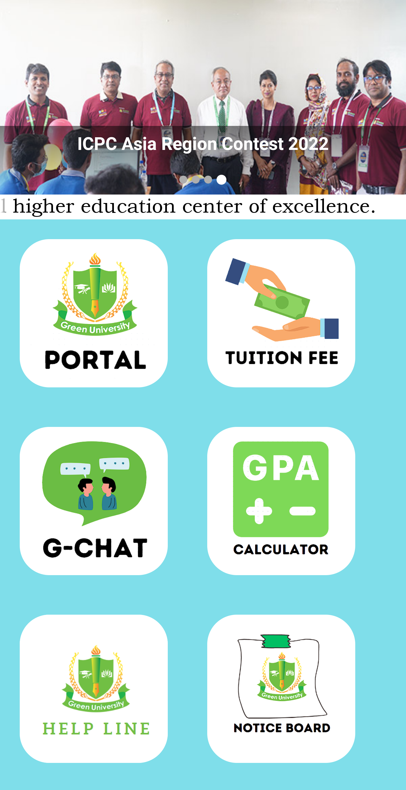

# GUB Student Helper App

Welcome to the GUB Student Helper App repository! This mobile application is specifically designed for students at Green University of Bangladesh, providing a comprehensive set of features to enhance the academic experience.

## Features

- Easy access to the student portal for online services.
- CGPA calculator for effortless grade tracking.
- Secure tuition fee payment system within the app.
- Chat functionality for seamless communication with peers.
- Helpline services for various departments and support.
- Notice board for essential university updates.

## Screenshots




## Getting Started

To get started with the GUB Student Helper App, follow these steps:

1. Clone the repository using the following command:
```
git clone https://github.com/73-sk-nahid/Student_Helper_APP.git
```

2. Open the project in Android Studio.

3. Run the app on your Android device or emulator.

## Contact

For any inquiries or suggestions, feel free to contact us at nahidsheikh2001@gmail.com.

## GitHub Repository

Find the full source code and contribute to the project on GitHub:
[GitHub - GUB Student Helper App](https://github.com/73-sk-nahid/Student_Helper_APP)

We appreciate your interest and support in making the GUB Student Helper App a valuable tool for all Green University of Bangladesh students!
